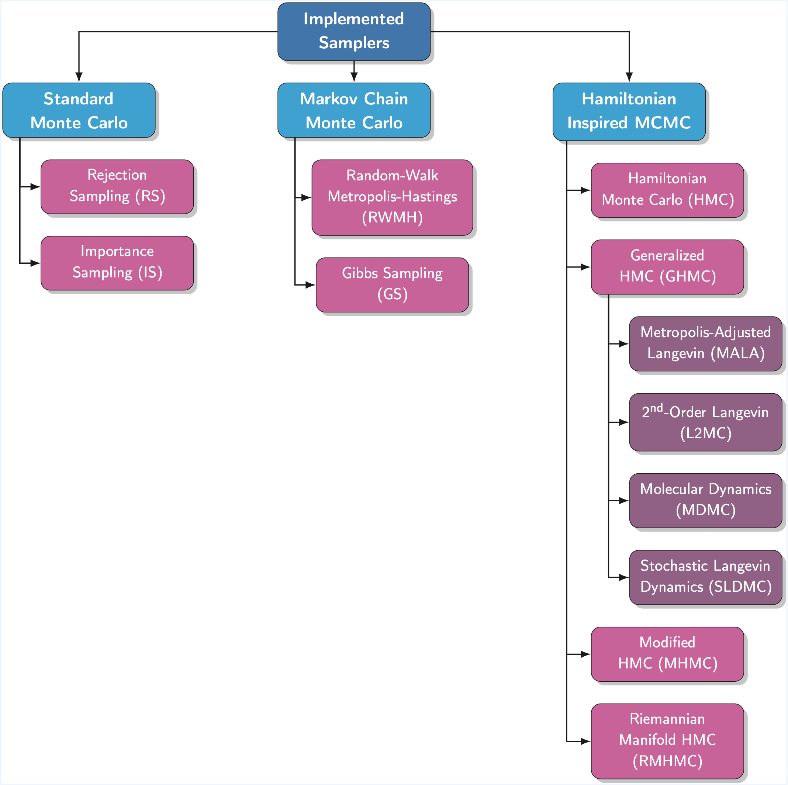

# pyHaiCS API Documentation

<div id="features-hierarchical", align="center">
    
</div>

In this section, we provide a detailed API reference for the `pyHaiCS` library. The library is organized around four main components: **Hamiltonian Samplers**, **Numerical Integrators**, **Adaptive Tuning**, and **Sampling Metrics**. Each of these components is further divided into sub-components, such as the different samplers implemented in the library (e.g., HMC, GHMC, and the yet to be implemented, MMHMC), the numerical integrators (such as variants of Velocity-Verlet, and  2-Stage and 3-Stage MSSIs), or the s-AIA adaptive tuning scheme. The library also includes a variety of sampling metrics for diagnosing the convergence and efficiency of the sampling process, as well as multidisciplinary benchmarks for testing the performance of the library.

## Samplers

<div id="samplers", align="center">
    
</div>

Samplers are at the core of the `pyHaiCS` library, providing efficient algorithms for exploring complex probability distributions using Hamiltonian dynamics. The library supports both standard and adaptive variants of Hamiltonian Monte Carlo (HMC) and Generalized Hamiltonian Monte Carlo (GHMC), with implementations for both single-chain and multi-chain sampling.

Additionally, the library includes several special cases of GHMC, such as Molecular Dynamics Monte Carlo (MDMC), Stochastic Langevin Dynamics Monte Carlo (SLDMC), Metropolis-Adjusted Langevin Algorithm (MALA), and Second-Order Langevin Monte Carlo (L2MC).

!!! info "Implemented Samplers"
    The following samplers are currently available in **pyHaiCS**:

    #### Standard Monte Carlo
    - **Rejection Sampling (RS)**
    - **Importance Sampling (IS)**

    #### Markov Chain Monte Carlo
    - **Random-Walk Metropolis-Hastings (RWMH)**
    - **Gibbs Sampling (GS)**

    #### Hamiltonian-Inspired MCMC
    - **Hamiltonian Monte Carlo (HMC)**
    - **Generalized Hamiltonian Monte Carlo (GHMC)**, and the following special cases:
        - **Molecular Dynamics (MDMC)**
        - **Stochastic Langevin Dynamics Monte Carlo (SLDMC)**
        - **Metropolis-Adjusted Langevin Algorithm (MALA)**
        - **Second-Order Langevin Monte Carlo (L2MC)**
    - **s-AIA HMC/GHMC** (Adaptive Tuning Versions for HMC/GHMC)
    - **Modified Hamiltonian Monte Carlo (MHMC)**
    - **Riemannian Manifold Hamiltonian Monte Carlo (RMHMC)**

### Hamiltonian Monte Carlo (HMC)

```python
def HMC(x_init, potential_args, n_samples, burn_in, step_size,
        n_steps, potential, mass_matrix, integrator, n_chains, RNG_key)
```

Standard Hamiltonian Monte-Carlo (HMC) sampler.

**Algorithm:**

```
1. Initialize x₀
2. For i = 1 to n_samples:
    - Draw momentum p ~ N(0, M)  
    - Simulate Hamiltonian dynamics for n_steps:
        (x*, p*) = Integrator(x, p, step_size, n_steps)
    - Accept (x*, p*) with probability:
        min(1, exp(H(x,p) - H(x*,p*)))
    - Store x* (if accepted)
    - Discard the momentum p
3. Return samples after burn-in
```

**Parameters:**

- `x_init`: Initial position
- `potential_args`: Arguments for the potential function (e.g., training data for Bayesian models)
- `n_samples`: Number of samples to generate
- `burn_in`: Number of burn-in samples
- `step_size`: Integration step-size
- `n_steps`: Number of integration steps per proposal
- `potential`: Hamiltonian potential function
- `mass_matrix`: Mass matrix for the Hamiltonian dynamics
- `integrator`: Numerical integrator (default: VerletIntegrator)
- `n_chains`: Number of parallel chains (default: 4)
- `RNG_key`: Random number generator key (default: 42)

**Returns:**

- `samples`: Array of samples (multiple chains)

### Generalized Hamiltonian Monte Carlo (GHMC)

```python
def GHMC(x_init, potential_args, n_samples, burn_in, step_size,
         n_steps, potential, mass_matrix, momentum_noise, integrator, 
         n_chains, RNG_key)
```

Generalized Hamiltonian Monte-Carlo (GHMC) sampler with momentum updates.

**Algorithm:**

```
1. Initialize x₀, p₀
2. For i = 1 to n_samples:
    - Draw mu ~ N(0, M)
    - Propose updated momentum p' = sqrt(1-phi)*p + sqrt(phi)*mu
    - Propose new noise vector mu' = sqrt(1-phi)*mu + sqrt(phi)*p
    - Simulate Hamiltonian dynamics for n_steps:
        (x*, p*) = Integrator(x, p', step_size, n_steps)
    - Accept (x*, p*) with probability:
        min(1, exp(H(x,p') - H(x*,p*)))
    - Store (x*, p') (if accepted)
    - Otherwise, perform a momentum flip: (x, p) = (x, -p')
3. Return samples after burn-in
```

**Parameters:**

- Same as HMC, plus:
- `momentum_noise`: Noise parameter for momentum resampling

**Returns:**

- `samples`: Array of samples (multiple chains)

#### Special Cases of GHMC

!!! info
    For the sake of clarity, the latest version of `pyHaiCS` includes several particular samplers derivable from the core GHMC algorithm, such as **Molecular Dynamics Monte Carlo (MDMC)**, **Stochastic Langevin Dynamics Monte Carlo (SLDMC)**, **Metropolis Adjusted Langevin Algorithm (MALA)**, and **Second-Order Langevin Monte Carlo (L2MC)**.

    **Table: Special Cases of GHMC.**  

    | **Method** | $L$         | $\phi$                                   | **Metropolize Acceptance** |
    |------------|-----------|--------------------------------------|----------------------|
    | HMC        | any | 1                                    | yes                  |
    | MALA       | 1         | 1                                    | yes                  |
    | L2MC       | 1         | any                            | yes                  |
    | MDMC         | any | 0                                    | no                   |
    | SLDMC         | any | $\sqrt{(2\gamma\varepsilon)}$ (≪ 1), $\gamma > 0$                 | no                   |

    For SLDMC, $\gamma$ is the friction coefficient. (*Table adapted from ["Optimising performance of Hamiltonian Monte Carlo (HMC) in molecular simulation and computational statistics"](https://bird.bcamath.org/handle/20.500.11824/2005).*)


## Numerical Integrators

Likewise, numerous numerical integrators to simulate the Hamiltonian dynamics are implemented. **Important note:** All numerical integrators are implemented as classes that inherit from the `Integrator` class and have a common interface. All samplers call the `integrate()` method of the integrator class to simulate the Hamiltonian dynamics.

### Leapfrog/Modified 1-Stage Verlet Integrator (Default)

This is the default integrator used by pyHaiCS. It is a modified 1-stage Verlet integrator with momentum half-steps.

```python
integrator = VerletIntegrator()
```

**Algorithm:**

```
1. Update momentum (half-step): p = p - step_size/2 * potential_grad(x)
2. For i = 1 to (n_integration_steps - 1):
    - Update position (full-step): x = x + step_size * M^(-1) * p
    - Update momentum (full-step): p = p - step_size * potential_grad(x)
3. Update position (full-step): x = x + step_size * M^(-1) * p
4. Update momentum (half-step): p = p - step_size/2 * potential_grad(x)
5. Return x, p
```

### Multi-Stage Splitting Integrators (MSSIs)

The library implements various multi-stage splitting integrators for simulating Hamiltonian dynamics.

| Integrator | Nº of Stages ($k$) | Coefficients |
|------------|------------------|--------------|
| 1-Stage Velocity Verlet (VV1) | 1 | - |
| 2-Stage Velocity Verlet (VV2) | 2 | $b = 1/4$ |
| 2-Stage BCSS (BCSS2) | 2 | $b = 0.211781$ |
| 2-Stage Minimum-Error (ME2) | 2 | $b = 0.193183$ |
| 3-Stage Velocity Verlet (VV3) | 3 | $a = 1/3, b = 1/6$ |
| 3-Stage BCSS (BCSS3) | 3 | $a = 0.296195, b = 0.118880$ |
| 3-Stage Minimum-Error (ME3) | 3 | $a = 0.290486, b = 0.108991$ |

#### Second-Stage MSSIs

```python
integrator = MSSI_2(b)
```

Base class for second-stage multi-stage splitting integrators.

Available implementations:

- `VV_2`: Velocity-Verlet integrator ($b = 1/4$)
- `BCSS_2`: BCSS integrator ($b = 0.211781$)
- `ME_2`: Minimum Error integrator ($b = 0.193183$)

#### Third-Stage MSSIs

```python
integrator = MSSI_3(a, b)
```

Base class for third-stage multi-stage splitting integrators.

Available implementations:

- `VV_3`: Velocity-Verlet integrator ($a = 1/3, b = 1/6$)
- `BCSS_3`: BCSS integrator ($a = 0.296195, b = 0.118880$)
- `ME_3`: Minimum Error integrator ($a = 0.290486, b = 0.108991$)

## Adaptive Tuning Methods

### Statistical Adaptive Integration Approach (s-AIA)

Moreover, our library implements novel adaptive methods, such as **s-AIA**, for automatically tuning the parameters of the numerical integrator and the sampler. This algorithm is particularly useful for applications in computational statistics where manual tuning of parameters can be time-consuming and error-prone.

Importantly, the s-AIA algorithm in pyHaiCS is designed to be used as if it were a sampler, i.e., it can be called with the same syntax as the other samplers implemented in the library.

```python
def sAIA(x_init, potential_args, n_samples_tune, n_samples_check, 
         n_samples_burn_in, n_samples_prod, potential, mass_matrix, 
         target_AR, stage, sensibility, delta_step, compute_freqs, 
         sampler, RNG_key)
```

The s-AIA method works by iteratively optimizing the integration parameters to achieve a target acceptance rate while maintaining the efficiency of the sampling process. It consists of three main phases:

1. **Tuning Phase**: During this phase, the algorithm explores different combinations of step sizes and integration steps to find optimal values that lead to the desired acceptance rate.

2. **Burn-in Phase**: Once the parameters are tuned, this phase allows the sampler to converge to the target distribution while maintaining the optimized parameters.

3. **Production Phase**: The final phase where samples are collected using the optimized parameters.

The algorithm is particularly effective because it:

- Optimizes both the parameters of the numerical integrator and the sampler.
- Can be used with both HMC and GHMC samplers.
- Provides optimal coefficients for multi-stage splitting integrators.
- Includes momentum noise optimization for GHMC.
- Removes the need for manual tuning any parameters or running multiple chains.

**Parameters:**

- `x_init`: Initial position
- `potential_args`: Arguments for the potential function
- `n_samples_tune`: Number of samples to tune the parameters
- `n_samples_check`: Number of samples to check the convergence
- `n_samples_burn_in`: Number of samples for burn-in
- `n_samples_prod`: Number of samples for production
- `potential`: Hamiltonian potential function
- `mass_matrix`: Mass matrix for the Hamiltonian dynamics
- `target_AR`: Target acceptance rate
- `stage`: Number of stages for the multi-stage splitting integrator
- `sensibility`: Sensibility parameter for the s-AIA algorithm
- `delta_step`: Step size for the parameter search
- `compute_freqs`: Whether to compute the frequencies of the potential
- `sampler`: Sampler (default: HMC)
- `RNG_key`: Random number generator key

**Returns:**

- `samples`: Array of samples

## Evaluation Metrics

The library provides a comprehensive set of metrics for evaluating the performance and convergence of the samplers. These metrics are essential for diagnosing the quality of the sampling process and ensuring reliable results.

The `compute_metrics()` function can be used to compute all the metrics implemented in the library for a given set of samples.

```python
def compute_metrics(samples, thres_estimator, normalize_ESS)
```

**Parameters:**

- `samples`: Array of samples
- `thres_estimator`: Threshold estimator for the effective sample size (ESS)
- `normalize_ESS`: Whether to normalize the ESS values

### Acceptance Rate

```python
def acceptance_rate(num_acceptals, n_samples)
```

Computes the acceptance rate from a sequence of accepted/rejected proposals.

**Parameters:**

- `num_acceptals`: Number of accepted proposals
- `n_samples`: Total number of proposals

**Returns:**

- `float`: Acceptance rate between 0 and 1

### Rejection Rate

```python
def rejection_rate(num_acceptals, n_samples)
```

Computes the rejection rate from a sequence of accepted/rejected proposals.

**Parameters:**

- `num_acceptals`: Number of accepted proposals
- `n_samples`: Total number of proposals

**Returns:**

- `float`: Rejection rate between 0 and 1

### Potential Scale Reduction Factor (PSRF)

```python
def PSRF(samples)
```

Computes the potential scale reduction factor (Gelman-Rubin diagnostic) for multiple chains.

**Parameters:**

- `samples`: Array of samples from multiple chains

**Returns:**

- `float`: PSRF value

**Note:** A PSRF close to 1 indicates good convergence across chains.

### Effective Sample Size (ESS)

Geyer's initial Markov Chain Monte Carlo (MCE) estimator is implemented in the library.

*To be completed...*

### Monte-Carlo Standard Error (MCSE)

```python
def MCSE(samples, ess_values)
```

Computes the Monte Carlo Standard Error (MCSE) from the effective sample size (ESS).

**Parameters:**

- `samples`: Array of samples from the chain
- `ess_values`: Effective sample size values

**Returns:**

- `float`: Monte Carlo Standard Error

**Note:** The MCSE is a measure of the precision of the estimator, it is inversely proportional to the square root of the ESS.

### Integrated Autocorrelation Time (IACT)

```python
def IACT(samples, ess_values, normalized_ESS = True)
```

Computes the integrated autocorrelation time, which measures the autocorrelation between samples, it can also be defined as the number of Monte-Carlo iterations needed, on average, for an independent sample to be drawn.

**Parameters:**

- `samples`: Array of samples from the chain
- `ess_values`: Effective sample size values
- `normalized_ESS`: Whether to normalize the ESS values

**Returns:**

- `float`: Integrated autocorrelation time

**Note:** On average, IACT correlated samples are required in order to reduce the variance of the estimator by the same amount as a single uncorrelated sample.


## Utility Functions

### Kinetic Energy

```python
@jax.jit
def Kinetic(p, mass_matrix)
```

Computes the kinetic energy for given momentum and mass matrix.

### Hamiltonian

```python
def Hamiltonian(x, p, potential, mass_matrix)
```

Computes the total Hamiltonian energy.