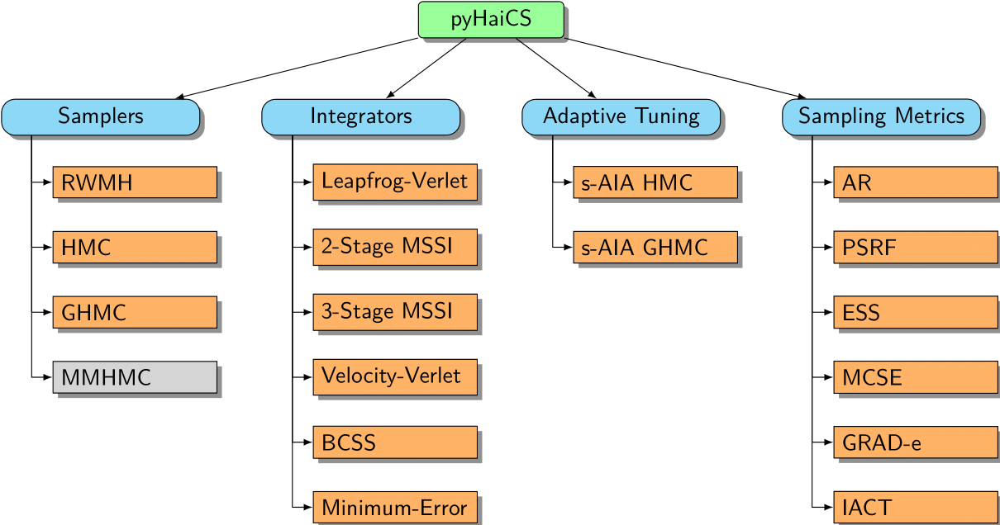

# pyHaiCS API Documentation

<div id="features-hierarchical", align="center">
    
</div>

In this section, we provide a detailed API reference for the `pyHaiCS` library. The library is organized around four main components: **Hamiltonian Samplers**, **Numerical Integrators**, **Adaptive Tuning**, and **Sampling Metrics**. Each of these components is further divided into sub-components, such as the different samplers implemented in the library (e.g., HMC, GHMC, and the yet to be implemented, MMHMC), the numerical integrators (such as variants of Velocity-Verlet, and  2-Stage and 3-Stage MSSIs), or the s-AIA adaptive tuning scheme. The library also includes a variety of sampling metrics for diagnosing the convergence and efficiency of the sampling process, as well as multidisciplinary benchmarks for testing the performance of the library.

## Samplers

Samplers are the main components of the library. They implement the Hamiltonian Monte Carlo (HMC) and Generalized Hamiltonian Monte Carlo (GHMC) algorithms, both in their standard and adaptive versions. Moreover, both *single-chain* and *multi-chain* versions are implemented.

### Hamiltonian Monte Carlo (HMC)

```python
def HMC(x_init, potential_args, n_samples, burn_in, step_size,
        n_steps, potential, mass_matrix, integrator, n_chains, RNG_key)
```

Standard Hamiltonian Monte-Carlo (HMC) sampler.

**Algorithm:**

```
1. Initialize x₀
2. For i = 1 to n_samples:
    - Draw momentum p ~ N(0, M)  
    - Simulate Hamiltonian dynamics for n_steps:
        (x*, p*) = Integrator(x, p, step_size, n_steps)
    - Accept (x*, p*) with probability:
        min(1, exp(H(x,p) - H(x*,p*)))
    - Store x* (if accepted)
    - Discard the momentum p
3. Return samples after burn-in
```

**Parameters:**

- `x_init`: Initial position
- `potential_args`: Arguments for the potential function (e.g., training data for Bayesian models)
- `n_samples`: Number of samples to generate
- `burn_in`: Number of burn-in samples
- `step_size`: Integration step-size
- `n_steps`: Number of integration steps per proposal
- `potential`: Hamiltonian potential function
- `mass_matrix`: Mass matrix for the Hamiltonian dynamics
- `integrator`: Numerical integrator (default: VerletIntegrator)
- `n_chains`: Number of parallel chains (default: 4)
- `RNG_key`: Random number generator key (default: 42)

**Returns:**

- `samples`: Array of samples (multiple chains)

### Generalized Hamiltonian Monte Carlo (GHMC)

```python
def GHMC(x_init, potential_args, n_samples, burn_in, step_size,
         n_steps, potential, mass_matrix, momentum_noise, integrator, 
         n_chains, RNG_key)
```

Generalized Hamiltonian Monte-Carlo (GHMC) sampler with momentum updates.

**Algorithm:**

```
1. Initialize x₀, p₀
2. For i = 1 to n_samples:
    - Draw mu ~ N(0, M)
    - Propose updated momentum p' = sqrt(1-phi)*p + sqrt(phi)*mu
    - Propose new noise vector mu' = sqrt(1-phi)*mu + sqrt(phi)*p
    - Simulate Hamiltonian dynamics for n_steps:
        (x*, p*) = Integrator(x, p', step_size, n_steps)
    - Accept (x*, p*) with probability:
        min(1, exp(H(x,p') - H(x*,p*)))
    - Store (x*, p') (if accepted)
    - Otherwise, perform a momentum flip: (x, p) = (x, -p')
3. Return samples after burn-in
```

**Parameters:**

- Same as HMC, plus:
- `momentum_noise`: Noise parameter for momentum resampling

**Returns:**

- `samples`: Array of samples (multiple chains)

## Numerical Integrators

Likewise, numerous numerical integrators to simulate the Hamiltonian dynamics are implemented.

### Verlet Integrator

```python
class VerletIntegrator(Integrator):
    def integrate(self, x, p, potential_grad, n_steps, mass_matrix, step_size)
```

Leapfrog/Modified 1-Stage Verlet Integrator.

### Multi-Stage Splitting Integrators

#### Second-Order Integrators

```python
class MSSI_2(MultiStageSplittingIntegrator):
    def __init__(self, b)
```

Base class for second-order multi-stage splitting integrators.

Available implementations:
- `VV_2`: Velocity Verlet integrator
- `BCSS_2`: BCSS integrator
- `ME_2`: McLachlan-Engel integrator

#### Third-Order Integrators

```python
class MSSI_3(MultiStageSplittingIntegrator):
    def __init__(self, a, b)
```

Base class for third-order multi-stage splitting integrators.

Available implementations:
- `VV_3`: Velocity Verlet integrator
- `BCSS_3`: BCSS integrator
- `ME_3`: McLachlan-Engel integrator

## Adaptive Methods

### Self-Adaptive Integration Algorithm (sAIA)

The sAIA implementation includes several adaptive components:

1. **Tuning Phase**
```python
def _sAIA_Tuning(x_init, n_samples_tune, n_samples_check, step_size, n_steps, sensibility, target_AR, potential, potential_grad, potential_hessian, mass_matrix, delta_step, integrator, sampler, momentum_noise_lower, momentum_noise_upper, key)
```

2. **Burn-in Phase**
```python
def _sAIA_BurnIn(x_init, n_samples_burn_in, n_samples_prod, compute_freqs, step_size, n_steps, stage, potential, potential_grad, potential_hessian, mass_matrix, integrator, sampler, momentum_noise_lower, momentum_noise_upper, key)
```

3. **Optimal Coefficient Computation**
```python
def _sAIA_OptimalCoeffs(dimensionless_step_sizes, stage, key, n_coeff_samples=20)
```

4. **Momentum Noise Optimization**
```python
def optimal_momentum_noise(step_size_nondim, stage, D, a=None, b=None)
```

The adaptive methods automatically tune:
- Integration step size
- Number of integration steps
- Momentum noise parameters (for GHMC)
- Integration coefficients
- Mass matrix

## Utility Functions

### Metrics

```python
def acceptance_rate(accepted)
```

Computes the acceptance rate from a sequence of accepted/rejected proposals.

### Kinetic Energy

```python
@jax.jit
def Kinetic(p, mass_matrix)
```

Computes the kinetic energy for given momentum and mass matrix.

### Hamiltonian

```python
def Hamiltonian(x, p, potential, mass_matrix)
```

Computes the total Hamiltonian energy.