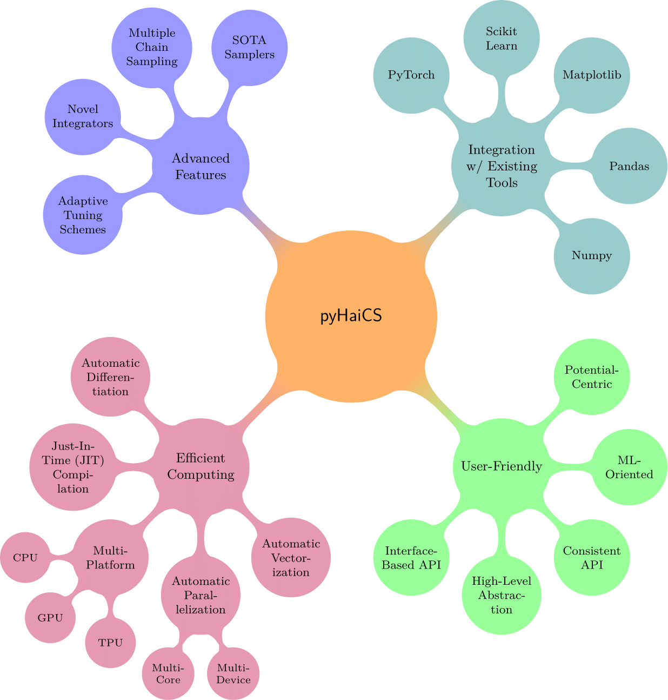
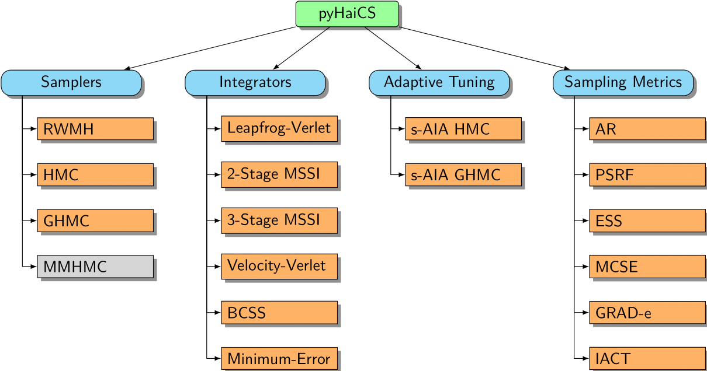

# Welcome to pyHaiCS!

    

Introducing `pyHaiCS`, a Python library for **Hamiltonian-based Monte-Carlo** methods tailored towards practical applications in *computational statistics*. From sampling complex probability distributions, to approximating complex integrals — such as in the context of Bayesian inference — `pyHaiCS` is designed to be fast, flexible, and easy to use, with a focus on providing a user-friendly interface for researchers and practitioners while also offering users a variety of *advanced features*. 

Although currently in development, our library implements a wide range of **sampling algorithms** — including single-chain and multi-chain Hamiltoninan Monte-Carlo (HMC) and Generalized HMC (GHMC); a variety of numerical schemes for the *integration* of the simulated Hamiltonian dynamics (including a generalized version of Multi-Stage Splitting integrators), or a novel *adaptive* algorithm — Adaptive Integration Approach in Computational Statistics (s-AIA) — for the automatic tuning of the parameters of both the numerical integrator and the sampler. 

Likewise, several utilities for *diagnosing* the convergence and efficiency of the sampling process, as well as *multidisciplinary* benchmarks — ranging from simple toy problems such as sampling from specific distributions, to more complex real-world applications in the fields of computational biology, Bayesian modeling, or physics — are provided.

## pyHaiCS Features

    

    

## Introduction to Hamiltonian Monte-Carlo

Markov Chain Monte Carlo (MCMC) methods are powerful tools for sampling from complex probability distributions, a task that lies at the heart of many statistical and machine learning problems. Among these, **Hamiltonian Monte Carlo (HMC)** stands out as a particularly efficient and versatile algorithm, especially well-suited for high-dimensional problems.

Traditional MCMC methods, such as the Metropolis-Hastings algorithm or Gibbs sampling, often rely on random walk behavior to explore the target distribution. While effective, this can lead to slow convergence, especially when dealing with complex, multimodal, or high-dimensional distributions.  HMC addresses these limitations by introducing concepts from **Hamiltonian dynamics** to guide the exploration of the sample space.

At its core, HMC leverages the idea of simulating the movement of a particle in a physical system to generate efficient transitions across the target distribution.  Let's break down the key elements:

*   **Augmenting the State Space:**  Imagine the probability distribution we want to sample from – our **target distribution** – as defining a potential energy landscape. Regions of high probability correspond to valleys (low potential energy), while regions of low probability are hills (high potential energy). To introduce dynamics, HMC *augments* our state space by adding **auxiliary momentum variables**, typically denoted as $\mathbf{p}$, for each position variable $\mathbf{q}$ (our original parameters of interest).

*   **Hamiltonian Function:** We then define a **Hamiltonian function**, $H(\mathbf{q}, \mathbf{p})$, which describes the total energy of the system.  This function is typically the sum of two components:
    *   **Potential Energy**, $U(\mathbf{q})$:  This is directly related to our target probability distribution, $\pi(\mathbf{q})$. Specifically, we often set $U(\mathbf{q}) = -\log \pi(\mathbf{q})$.  Minimizing the potential energy corresponds to finding regions of high probability under $\pi(\mathbf{q})$.
    *   **Kinetic Energy**, $K(\mathbf{p})$: This term depends on the momentum variables and is usually defined as the energy of a fictitious "particle" associated with our system. A common choice is the kinetic energy of a particle with unit mass: $K(\mathbf{p}) = \frac{1}{2} \mathbf{p}^T \mathbf{M}^{-1} \mathbf{p}$, where $\mathbf{M}$ is a mass matrix (often set to the identity matrix for simplicity).

    The Hamiltonian is then $H(\mathbf{q}, \mathbf{p}) = U(\mathbf{q}) + K(\mathbf{p}) = -\log \pi(\mathbf{q}) + \frac{1}{2} \mathbf{p}^T \mathbf{M}^{-1} \mathbf{p}$.

*   **Hamilton's Equations of Motion:**  The dynamics of the system are governed by **Hamilton's equations of motion**. These equations describe how the positions and momenta evolve over time:

    $$
    \begin{aligned}
    \frac{d\mathbf{q}}{dt} &= \frac{\partial H}{\partial \mathbf{p}} = \mathbf{M}^{-1} \mathbf{p} \\
    \frac{d\mathbf{p}}{dt} &= -\frac{\partial H}{\partial \mathbf{q}} = -\frac{\partial U}{\partial \mathbf{q}} = \nabla \log \pi(\mathbf{q})
    \end{aligned}
    $$

    These equations dictate that the "particle" will move through the potential energy landscape. Crucially, under these dynamics, the Hamiltonian $H(\mathbf{q}, \mathbf{p})$ (and thus the density $\propto \exp(-H(\mathbf{q}, \mathbf{p}))$) remains constant over time in a continuous system.

*   **Numerical Integration:**  To simulate these dynamics on a computer, we need to discretize time and use a **numerical integrator**.  `pyHaiCS` offers a variety of numerical integrators, including symplectic integrators, which are particularly well-suited for Hamiltonian systems because they preserve important properties of the dynamics, such as volume preservation and near-conservation of energy.

*   **Metropolis Acceptance Step:**  While the Hamiltonian dynamics ideally preserve the target distribution, numerical integration introduces approximations, and thus trajectories are not perfectly Hamiltonian. To correct for these errors and ensure we are still sampling from the exact target distribution, HMC incorporates a **Metropolis acceptance step**. After evolving the system for a certain time using numerical integration, we compute the change in Hamiltonian, $\Delta H$, between the start and end points of the trajectory.  We then accept the proposed new state with probability:

    $$
    \alpha = \min\left(1, \exp(-\Delta H)\right) = \min\left(1, \exp(H(\mathbf{q}_{old}, \mathbf{p}_{old}) - H(\mathbf{q}_{new}, \mathbf{p}_{new}))\right)
    $$

    If the proposal is rejected, we simply retain the previous state. This acceptance step guarantees that the HMC algorithm samples from the correct target distribution, even with numerical integration approximations.

**Benefits of HMC:**

By leveraging Hamiltonian dynamics, HMC offers several advantages over traditional MCMC methods:

*   **Efficient Exploration of State Space:** The Hamiltonian dynamics allows for more directed and less random-walk-like exploration of the target distribution.  Trajectories tend to follow gradients of the potential energy, enabling the sampler to move more quickly across the state space, especially in high dimensions.
*   **Reduced Random Walk Behavior:**  Unlike algorithms relying on random proposals, HMC trajectories can travel significant distances in state space in each step, leading to faster convergence and more efficient sampling, particularly for distributions with complex geometries or long, narrow regions of high probability.
*   **Scalability to High Dimensions:** The efficiency gains of HMC become more pronounced as the dimensionality of the problem increases, making it a powerful tool for complex statistical models with many parameters.

In summary, Hamiltonian Monte Carlo provides a sophisticated and efficient approach to MCMC sampling by harnessing the principles of Hamiltonian dynamics. By carefully simulating the physical movement of a system guided by the target distribution, HMC overcomes many limitations of traditional MCMC methods, enabling faster and more reliable sampling from complex, high-dimensional probability distributions.  `pyHaiCS` aims to make these powerful methods accessible and easy to use for a wide range of applications in computational statistics and beyond.